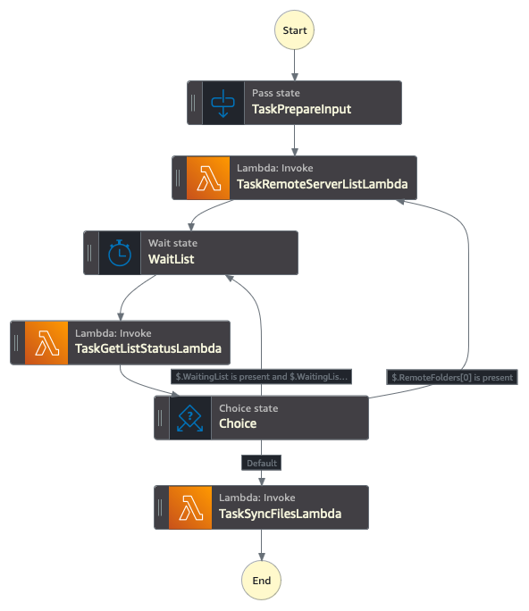

# File Transfer Synchronization solution
## Introduction

This solution implements an automated strategy for synchronizing remote SFTP repositories with local S3 buckets. It schedules and orchestrates the process of listing remote directories, detecting changes, and transferring files.

**The solution leverages the following AWS services:**
- [Amazon EventBridge Scheduler](https://docs.aws.amazon.com/scheduler/latest/UserGuide/what-is-scheduler.html)
- [AWS Step Functions](https://aws.amazon.com/step-functions/)
- [AWS Transfer Family SFTP Connectors](https://docs.aws.amazon.com/transfer/latest/userguide/creating-connectors.html)

**Key features:**
- Monitors remote SFTP servers using SFTP Connectors' [List capabilities](https://docs.aws.amazon.com/transfer/latest/userguide/sftp-connector-list-dir.html)
- Transfers missing or updated files using [SFTP Connector Retrieve action](https://docs.aws.amazon.com/transfer/latest/userguide/transfer-sftp-connectors.html)
- Supports recursive synchronization of entire folder structures
- Fully serverless architecture for cost-effective and scalable operations

## Architecture

A combination of Lambda, Step Functions and Transfer Family features facilitates data movement. Only the Transfer Family connectors move the data, Step Functions and Lambda determine what needs to be copied, and Event Bridge Scheduler acts as the trigger based on your needs. The solution is completely stateless, making use of file modification times to compare and detect new or changed files that need to be transferred.

**High level architecture:**

 

**Step Function visualization:**



### Component Interactions

1. **Event Bridge Scheduler**
   - The Event Bridge Scheduler triggers the Step Function execution based on the configured schedule (e.g., daily, hourly, or a custom cron expression).
   - There are multiple schedules based on the Configuration files in this project and the Event passed to Step Functions includes the required parameters according to each schedule configuration.

2. **Step Function**
   - The Step Function orchestrates the entire process and coordinates the interaction between different components.
   - For each `SyncSettings`, it invokes the `RemoteFoldersList` Lambda function interacts with the Transfer Family SFTP Connector to asynchronously retrieve a list of files in the remote folders to be synchronized.
   - Then use the `GetListStatus` Lambda function, to check if the `List` process is finished and optionally get the list of child folder if `Recursive` is enabled to run a list again for those sub folders.
   - The `SyncRemoteFolder` Lambda function detects if new or modified files are available in the remote server, and then invokes the Transfer Family SFTP Connector to asynchronously transfer those files from the remote repository to the local S3 bucket.
   - If any errors occur during the synchronization process, the Step Function captures the error and sends a notification to the configured SNS topic.

3. **Transfer Family SFTP Connector**
   - The Transfer Family SFTP connector is responsible for establishing a secure connection to the remote SFTP server.
   - It handles the listing of files in the remote repository and the transfer of files between the remote repository and the local S3 bucket.
   - The connector uses the configured security policy, trusted public keys and secrets stored in AWS Secrets Manager to ensure secure communication with the remote server.

4. **S3 Buckets**
   - Only one bucket is created by this solution to store the results generated by the Transfer Family SFTP Connector when Listing the remote SFTP directories.
   - The solution can use as many S3 Buckets as needed for a target for the Transfer Family SFTP Connector Sync process, when the files are copied from the remote SFTP to local the local S3 Bucket. These S3 Buckets are defined in the Configuration Files.

5. **AWS Secrets Manager**
   - Securely stores access credentials based on Username, Password and/or Certificate.

6. **SNS Topic and CloudWatch**
   - The SNS topic is used for sending notifications in case of errors or failures during the execution process.
   - CloudWatch publishes messages to the SNS topic when an error occurs executing Step Functions, allowing subscribers (e.g., email addresses) to be notified.
   - CloudWatch Dashboards also centralizes all the important Metrics and Logs generated by the solution.

### Static Public IPs

Each of the Transfer Family Connectors is created with 3 Static Public IPs that you can use in case the 3rd party company require to define an allow list. This [IPs doesn't change](https://aws.amazon.com/about-aws/whats-new/2024/01/aws-transfer-family-static-ip-sftp-connectors/) during the Connector Lifecycle.

## Usage

The reference architecture is fully defined as a dynamic CDK Application which simplifies the process of defining the whole infrastructure in code and potentially automate the deployment through a simple pipeline.

To do so, you just need to push new configuration changes as `json` files to `./configuration/sftp/` and deploy the project. Each of the files defines the configuration for a specific remote SFTP Server and multiple configuration rules. 

**The recommended approach is to use the provided [CLI](cli.py) script to automatically generate and modify the config files, more details in the [Deployment Section](#deployment)**

The configuration file structure and content needs the following data:

```
{
    "Description": <Connection Description>,
    "Name": <Identifying name for resources, no spaces allowed>,
    "Schedule": <Tag or AWS Cron Expression>,
    "Url": <Remote SFTP Server URL, FQDN and Port allowed>,
    "SecurityPolicyName": <TransferSFTPConnectorSecurityPolicy-2024-03 or TransferSFTPConnectorSecurityPolicy-2023-07>,
    "SyncSettings": [
        {
            "LocalRepository": {
                "BucketName": <Local Bucket Name>,
                "Prefix": <Local Prefix>
            },
            "RemoteFolders": {
                "Folder": <Remote Folder to Sync>,
                "Recursive": <true / false>
            }
        },
        { ... }
    ],
    "PublicKey": [
        "ssh-rsa AAAAB[...]5yQ==",
        "..."
    ]
}
```

You can check the [example configuration file](configuration/examples/example-sftp-sync.json). Within AWS Account service limits, you can have as many configuration files as you need, and on the `SyncSettings` configuration list, you can define as many Remote to Local pairs as you wish and all will be run during the same schedule for the same Remote SFTP Server.
The CDK Application will automatically resolve all the IAM Role permissions needed for the process to work and will create all the needed resources, including Event Bridge Scheduler, SFTP Connector and Secrets Manager Secret.

### Cron configuration
For the Cron expression, you can use any of the pre-defined TAGs for simplicity or you can define your own cron expression. Keep in mind that this needs to be an [AWS Event Bridge Cron expression format](https://docs.aws.amazon.com/eventbridge/latest/userguide/eb-scheduled-rule-pattern.html#eb-cron-expressions). Available TAGs are:

| TAG | Expression |
| :---------------- | :------: |
| @monthly | 0 0 1 * ? * |
| @daily | 0 0 * * ? * |
| @hourly | 0 * * * ? * |
| @minutely | * * * * ? * |
| @sunday | 0 0 ? * 1 * |
| @monday | 0 0 ? * 2 * |
| @tuesday | 0 0 ? * 3 * |
| @wednesday | 0 0 ? * 4 * |
| @thursday | 0 0 ? * 5 * |
| @friday | 0 0 ? * 6 * |
| @saturday | 0 0 ? * 7 * |
| @every10min | 0/10 * * * ? * |

### Replaceable Tags in Remote Folder Paths

The solution supports the use of replaceable tags in the remote folder paths. This feature allows for dynamic folder selection based on the current date (in UTC). The following tags are available:

- `%year%`: Replaced with the current four-digit year (e.g., 2024)
- `%month%`: Replaced with the current two-digit month (e.g., 03 for March)
- `%day%`: Replaced with the current two-digit day of the month (e.g., 15)

You can use these tags individually or in combination within the `RemoteFolders` > `Folder` path in your configuration. The solution allows you to define your own format. For example:

- "/data/%year%": Lists only the folder for the current year
- "/data/%year%/%month%": Lists the folder for the current year and month
- "/data/%year%-%month%-%day%": Lists the folder for the specific date

This feature allows for more flexible and automated folder synchronization based on current dates, which is particularly useful for organizing providing data partitioned by time periods.

### Trusted Public Key configuration
Transfer Family Connector service allows you to validate the identity of the remote server by configuring an expected trusted host key for the connection. You can optionally add more than one Key, and you need to do so in the `PublicKey` within the JSON configuration file for each remote server as a list of strings containing the trusted certificates. You can follow [this guide](https://docs.aws.amazon.com/transfer/latest/APIReference/API_SftpConnectorConfig.html) on how to get the cert and the expected format.

## Access Credentials

> **Important Note**: After deploying the configuration for a new Remote Server, you need to login to AWS and manually define the content of the Secret Manager Secret. This is due to security and to avoid your secret credentials being stored in your git repository and Cloud Formation deployment. It also protects the infrastructure from unwanted changes to working credentials when new changes are deployed to the solution.

When you modify the Secret content the key/values and format will depend on the remote server authentication strategy, [you can follow this guide](https://docs.aws.amazon.com/transfer/latest/userguide/sftp-connector-secret-procedure.html) to understand how to do it.

## Monitoring
As part of the solution, we are deploying a CloudWatch Dashboard to centralizes all important metrics and logs filters for troubleshooting. An SNS topic is also created for email notifications if Step Functions fail to run for any reason, you just need to subscribe to it  (Topic Name: TransferSyncServiceStack-NotificationTopic###).
It's especially important to monitor the Transfer Family Connector logs, as those will expose connectivity, authentication, non-available remote folders, etc.

[Lambda PowerTools](https://docs.powertools.aws.dev/lambda/python/2.40.1/) was also implemented to improve logging capabilities. By default every lambda function will be logging the same type of information, but we now enabled a debug mode that allows you to get more data, including the request context and event. To do so, you just need to modify the Lambda function Environment Variable `POWERTOOLS_LOG_LEVEL`. You can also change this through a new deployment by modifying the CDK project configuration parameters. Debug mode is includes Lambda Events that can be very verbose, so use with caution.
Additionally, all the Lambda executions withing a Step Function uses the SFN Execution ID as a Correlation ID so you can easily filter single runs in the logs.

## Solution Cost
The solution is fully serverless, meaning that you pay for what you use. The main cost factor for the solution will depend on the number of files being monitored, the frequency at which the process runs and the amount of GBs being transferred. Click here to check be on the [Transfer Family SFTP Connectors public pricing](https://aws.amazon.com/aws-transfer-family/pricing/).

### Example Scenario:

You are monitoring one remote SFTP Server. You are running an a recursive sync once per day and the server has a total of 10 folders, 5000 files evenly distributed and 20MB per file.
The first time the schedule runs, everything will be sync and you'll have a **on-time** cost of:

| Pricing Category | Cost (N. Virginia) | Unit | Total |
| :---------------- | :------: | :----: | :----: |
| SFTP Connector Calls - List | 0.001 / API Call | 10 API calls | $0.01 |
| SFTP Connector Calls - Transfer | 0.001 / API Call | 500 API calls |  $0.50 |
| SFTP Connector Calls - Data Transfer | 0.4 / GB | 98 GB |  $39.06 |
| Total: | | | $39.57 |

After the first replication, the solution will only copy new or modified files from the target server once per day. In this example 5% of the files gets modified each day:

| Pricing Category | Cost (N. Virginia) | Unit | Total |
| :---------------- | :------: | :----: | :----: |
| SFTP Connector Calls - List | $0.001 / API Call | 10 API calls | $0.01 |
| SFTP Connector Calls - Transfer | $0.001 / API Call | 25 API calls |  $0.03 |
| SFTP Connector Calls - Data Transfer | $0.4 / GB | 5 GB |  $1.95 |
| Total: | | | $1.99 per day |

## Pre requirements

This project is built using Python3 and CDK, before you start, make sure to have all the pre requirements properly installed in your environment.

* AWS CLI https://aws.amazon.com/cli/ 
* AWS CDK 2.150.0+ https://docs.aws.amazon.com/cdk/latest/guide/getting_started.html#getting_started_install
* Python 3.9+
* Python venv

## Deployment
Deploying the solution is easy, you just need to

MacOS and Linux:

Step 1: To manually create a virtualenv on MacOS and Linux:

```
python3 -m venv .venv
```

Step 2: After the init process completes and the virtualenv is created, you can use the following command to activate your virtualenv

```
source .venv/bin/activate
```

Go to Step 4 for MacOS and Linux Users.

Windows:

Step 3: Windows users can activate the virtualenv with this command:

```
.venv\Scripts\activate.bat
```

Step 4: Once the virtualenv is activated, you can install the required dependencies.

```
pip install -r requirements.txt
```
Step 5: Create new configuration files running the provided CLI and following the instructions.

```
python3 cli.py
```

Step 6: If this is your first time using CDK with the target AWS Account you'll need to bootstrap the environment.

```
cdk bootstrap
```

Step 7: At this point you can now synthesize the CloudFormation template for this code and deploy it.

```
cdk synth
cdk deploy
```

## Useful commands

 * `cdk ls`          list all stacks in the app
 * `cdk synth`       emits the synthesized CloudFormation template
 * `cdk deploy`      deploy this stack to your default AWS account/region
 * `cdk diff`        compare deployed stack with current state
 * `cdk docs`        open CDK documentation

 ## Troubleshooting and Support

For issues or questions, please [open an issue](https://github.com/aws-samples/file-transfer-sync-solution/issues) in this repository.

## Security
See [CONTRIBUTING](CONTRIBUTING.md) for more information.

## License
This library is licensed under the MIT-0 License. See the [LICENSE](LICENSE) file.